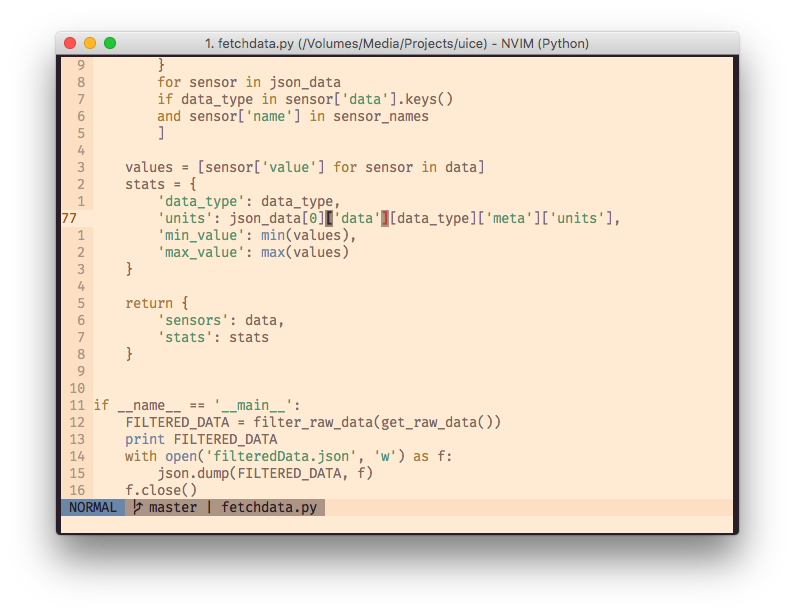

# conifer2
Forest colours for your editor and terminal. Inspired by jsphsnkr's
[conifer](https://github.com/jsphsnkr/colours) and based on Ethan Schoonover's
[solarized](http://ethanschoonover.com/solarized).

conifer2 shares many properties with solarized. It supports both light and
dark backgrounds, and most solarized themes will look good under it.

# Samples

## Python

## Vimscript

# Author's note
The palette is more or less finalised but the Vim colour scheme is still
being worked on. My work is mostly web-based; if you find something that
looks weird, let me know!